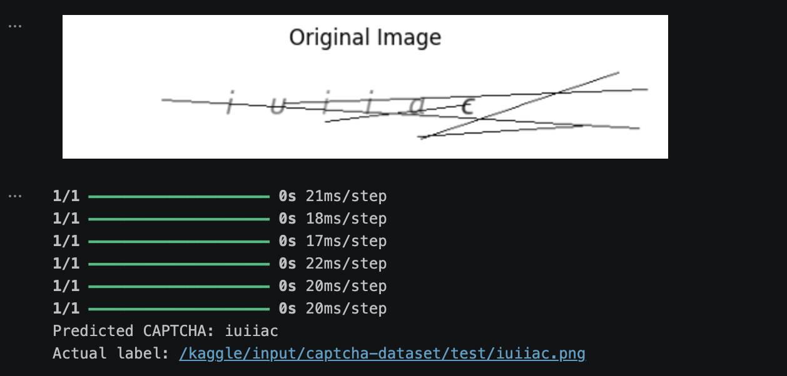

# CAPTCHA Recognizer

A Python/TensorFlow/OpenCV notebook for recognizing text in CAPTCHA images. The workflow cleans noisy CAPTCHA images, segments them into individual characters, trains a convolutional neural network on those characters, and then combines character predictions back into a full CAPTCHA string.



## What It Does

- Loads training and test CAPTCHA images from a Kaggle-style dataset folder.
- Uses OpenCV preprocessing to remove noise lines, crop extra whitespace, binarize images, and prepare characters for recognition.
- Finds character contours, applies box cleanup, pads each segmented character, and resizes characters to `128x128` grayscale images.
- Reads labels directly from image filenames, such as `iuiiac.png`.
- Trains a TensorFlow/Keras CNN with convolution, batch normalization, pooling, dropout, and early stopping.
- Evaluates the trained model with loss, accuracy, precision, and recall.
- Predicts new CAPTCHA text one character at a time and joins the predictions into the final label.

## Files

- `main.ipynb` - the full preprocessing, training, evaluation, and prediction pipeline.
- `screenshot.png` - an example notebook output showing an original CAPTCHA image and the predicted label.

## Dataset Layout

The notebook expects images to be arranged like this:

```text
/kaggle/input/captcha-dataset/
  train/
    abc123.png
  test/
    xyz789.png
```

Each image filename is treated as its label, so filenames should contain the exact alphanumeric CAPTCHA text.

## Requirements

Install Python packages for:

- TensorFlow/Keras
- OpenCV
- NumPy
- pandas
- matplotlib
- scikit-learn

If running outside Kaggle, update `train_dir`, `test_dir`, and `base_dir` in `main.ipynb` to point to your local dataset paths.
